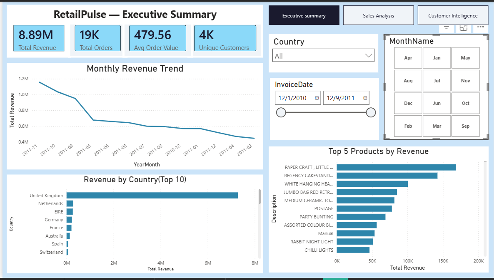
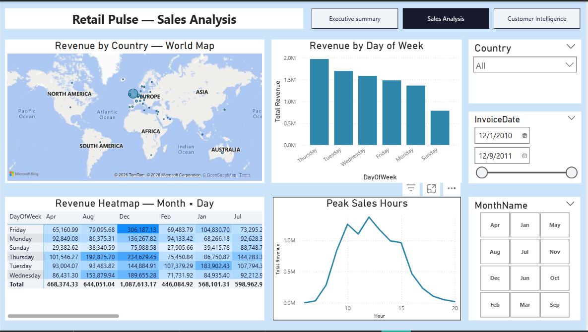
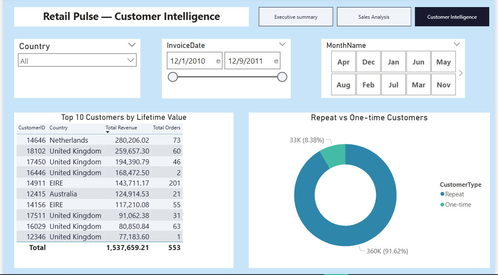

# RetailPulse — Retail Sales Analytics & BI Dashboard


## Project Overview
End-to-end retail analytics project analyzing 541,909 transactions 
from a UK-based online retailer (2010–2011). Built a complete 
data pipeline from raw Excel data to an interactive 3-page 
Power BI business intelligence dashboard.

## Tools & Technologies
| Tool | Purpose |
|------|---------|
| Python (Pandas, NumPy) | Data cleaning & EDA |
| Matplotlib & Seaborn | Exploratory visualizations |
| MySQL | Data storage & SQL analysis |
| Power BI Desktop | Interactive dashboard |
| Facebook Prophet | 90-day sales forecasting |
| GitHub | Version control |

## Dataset
- **Source:** UCI Online Retail Dataset
- **Size:** 541,909 transactions → cleaned to 392,692
- **Period:** December 2010 – December 2011
- **Link:** https://archive.ics.uci.edu/dataset/352/online+retail

## Project Structure
```
RetailPulse/
├── notebooks/
│   ├── 01_data_loading.ipynb
│   ├── 02_data_cleaning.ipynb
│   ├── 03_eda.ipynb
│   ├── 04_sql_analysis.ipynb
│   ├── 05_insights.ipynb
│   └── 06_forecasting.ipynb
├── sql_queries/
│   ├── 01_monthly_revenue.sql
│   ├── 02_revenue_by_country.sql
│   └── ... (13 queries total)
├── dashboard/
│   └── screenshots/
└── README.md
```

## Key Steps
1. **Data Loading** — Loaded 541,909 rows from UCI Excel file
2. **Data Cleaning** — Removed duplicates, nulls, cancellations. 
   Engineered 6 new time-based features
3. **EDA** — 9 charts revealing revenue trends, 
   geographic patterns and customer behavior
4. **SQL Analysis** — 13 queries using GROUP BY, 
   subqueries and RANK() window functions
5. **Power BI Dashboard** — 3-page interactive dashboard 
   with DAX measures and synchronized slicers
6. **Forecasting** — 90-day revenue forecast using 
   Facebook Prophet with 95% confidence intervals

## Key Business Insights
1. **Peak month** — November 2011 was highest revenue month
2. **Geographic risk** — UK drives 83% of revenue creating single-market dependency
3. **Customer loyalty gap** — 91.6% repeat vs 8.4% one-time buyers
4. **Peak trading window** — Thursday 10am–12pm is optimal for promotions and campaigns
5. **Forecasting** — Projected £X revenue over next 90 days

## How to Run
```bash
# Clone the repo
git clone https://github.com/KunalMahajan720/RetailPulse-Sales-Analytics

# Install dependencies
pip install pandas numpy matplotlib seaborn prophet sqlalchemy pymysql openpyxl

# Run notebooks in order
# 01 → 02 → 03 → 04 → 05 → 06
```
## Dashboard Preview

### Page 1 — Executive Summary


### Page 2 — Sales Analysis


### Page 3 — Customer Intelligence

